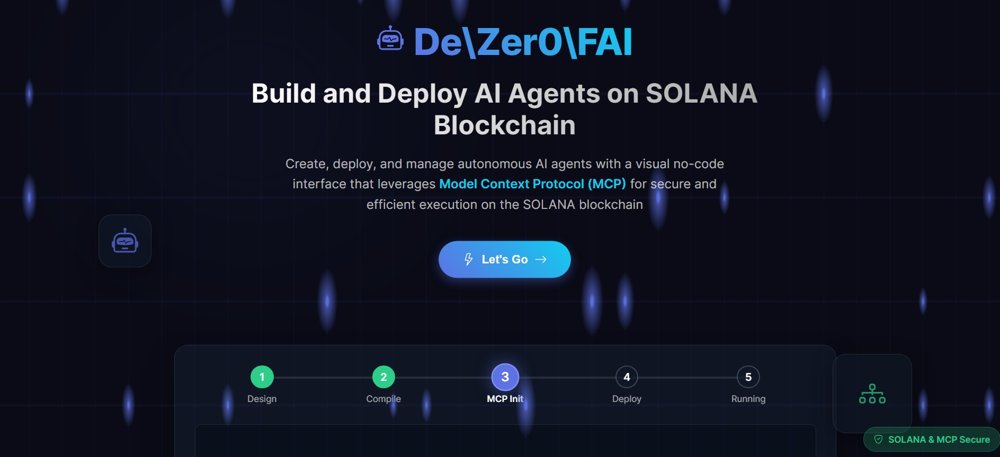

# DeFAI Agent Deployer - No-Code AI Agent Builder



## Overview

DeFAI Agent Deployer is a powerful no-code platform that enables users to create, deploy, and manage AI agents on the SUI blockchain. With an intuitive drag-and-drop interface, anyone can build sophisticated AI workflows without writing a single line of code, and deploy them as autonomous agents that can perform trading operations and other tasks on the SUI blockchain.

## Features

### No-Code Builder
- **Visual Workflow Designer**: Create complex AI agent workflows using an intuitive drag-and-drop interface
- **Pre-built Components**: Easily add and configure AI models, memory systems, and tools
- **Flow-Based Programming**: Connect nodes with edges to create sophisticated agent behaviors
- **Real-Time Preview**: See your agent design take shape as you build

### Agent Components
- **Agent Node**: The core component that coordinates models, memory, and tools
- **Model Node**: Select and configure various AI models (Claude, GPT, etc.) for your agent
- **Memory Node**: Add different types of memory (short-term, long-term, Redis) to your agent
- **Tool Node**: Integrate various tools (API calls, data processing) into your agent
- **Strategy Node**: Define trading strategies and decision-making logic
- **Notification Node**: Configure alerts and status updates
- **Payment Node**: Handle on-chain transactions and payments

### Deployment & Management
- **One-Click Deployment**: Deploy your agent to the SUI blockchain with a single click
- **Wallet Integration**: Connect your SUI wallet for secure deployment and transactions
- **Real-Time Monitoring**: Track agent performance, logs, and metrics in real-time
- **Dashboard**: Manage all your agents from a central dashboard

### Trading Features
- **Market Analysis**: Analyze SOL/USDC market data
- **Automated Trading**: Execute trades based on predefined strategies
- **Risk Management**: Set profit targets, stop losses, and risk levels
- **Performance Tracking**: Monitor trading performance with detailed metrics

## Getting Started

### Prerequisites
- A modern web browser (Chrome, Firefox, Edge, etc.)
- A SUI wallet (e.g., Sui Wallet browser extension)


### Building Your First Agent

#### 1. Start with the Flow Builder
- Click on "Flow Builder" in the navigation
- Use the sidebar to drag nodes onto the canvas

#### 2. Design Your Agent Workflow
- Add an Agent Node as the main component
- Add Model, Memory, and Tool nodes
- Connect them according to your desired workflow

#### 3. Configure Node Settings
- Click on each node to configure its settings
- Define parameters, strategies, and behaviors

#### 4. Save Your Flow
- Name your flow and save it for future use

#### 5. Deploy Your Agent
- Click the "Deploy" button to prepare your agent
- Confirm deployment settings on the next screen
- Complete the deployment process

#### 6. Monitor Your Agent
- Switch to the Dashboard view to monitor your agent
- View logs, metrics, and performance statistics
- Start, stop, or modify your agent as needed

## No-Code Components

### Agent Node
The core component that coordinates all aspects of your AI agent.
- **Settings**: Name, description, UID
- **Connections**: Can connect to models, memory stores, and tools

### Model Node
Configures the AI model that powers your agent's intelligence.
- **Models Available**: Claude, Gemini, GPT-4, etc.
- **Settings**: Context length, temperature, token limit

### Memory Node
Adds memory capabilities to your agent.
- **Memory Types**: 
  - Short-term (session)
  - Long-term (Redis)
  - Vector store (for retrieval)
- **Settings**: Storage duration, indexing options

### Tool Node
Integrates external tools and APIs with your agent.
- **Tool Types**:
  - Trading API
  - Data analysis
  - Web search
  - Custom API calls
- **Settings**: API parameters, authentication

### Strategy Node
Defines trading and decision-making strategies.
- **Strategy Types**:
  - Momentum trading
  - Mean reversion
  - Trend following
  - Custom strategies
- **Settings**: Time frames, indicators, thresholds

## Example Use Cases

### Trading Bot
Build an agent that analyzes market data and executes trades based on predefined strategies:
1. Agent Node (core)
2. Model Node (for analysis)
3. Memory Node (to track trade history)
4. Tool Node (trading API)
5. Strategy Node (trading logic)

### Market Analyzer
Create an agent that analyzes market trends and sends notifications:
1. Agent Node (core)
2. Model Node (for analysis)
3. Memory Node (to track historical data)
4. Tool Node (market data API)
5. Notification Node (for alerts)

## Security & Privacy

- **Wallet Security**: We never store your private keys
- **Data Privacy**: Your agent configurations are encrypted
- **On-Chain Security**: Transactions are secured by the SUI blockchain
- **UID Protection**: Your agent's UID is password-protected by your wallet address

## Project Structure

The DeFAI Agent Deployer codebase is organized as follows:

```
src/
├── components/              # UI components
│   ├── dashboard/           # Dashboard view components
│   │   ├── AgentDetail.jsx  # Agent details display
│   │   ├── AgentLogs.jsx    # Agent logs viewer
│   │   ├── AgentMetrics.jsx # Agent performance metrics
│   │   ├── AgentSettings.jsx # Agent configuration settings
│   │   └── Leaderboard.jsx  # Agent performance leaderboard
│   ├── modals/              # Modal dialog components
│   │   └── TradeConfirmationModal.jsx # Trade execution confirmation
│   ├── nodes/               # Flow builder node components
│   │   ├── AgentNode.jsx    # Agent node component
│   │   ├── MemoryNode.jsx   # Memory node component
│   │   ├── ModelNode.jsx    # AI model node component
│   │   ├── NodeTypes.jsx    # Node type definitions
│   │   ├── NotificationNode.jsx # Notification node component
│   │   ├── PaymentNode.jsx  # Payment/transaction node component
│   │   ├── StrategyNode.jsx # Trading strategy node component
│   │   └── ToolNode.jsx     # Tool integration node component
│   ├── App.jsx              # Main application component
│   ├── Dashboard.jsx        # Dashboard main component
│   ├── FlowCanvas.jsx       # Flow builder canvas component
│   ├── LandingPage.jsx      # Landing/welcome page
│   ├── Sidebar.jsx          # Flow builder sidebar with node palette
│   ├── UIDDisplay.jsx       # UID display component
│   ├── WalletConnector.jsx  # Wallet connection component
│   └── WalletHelper.jsx     # Wallet utility functions
│
├── contexts/                # React contexts
│   └── AuthContext.jsx      # Authentication context provider
│
├── services/                # API services
│   ├── agentApiService.js   # Agent API service
│   ├── agentDeploymentService.js # Agent deployment service
│   ├── authService.js       # Authentication service
│   └── walletService.js     # Wallet integration service
│
├── store/                   # State management (Zustand)
│   ├── agentStore.js        # Agent state management
│   ├── dashboardStore.js    # Dashboard state management
│   └── solanaStore.js       # Solana/SUI trading state
│
├── styles/                  # CSS styles
│   ├── AgentDetail.css
│   ├── AgentLogs.css
│   ├── AgentMetrics.css
│   ├── AgentSettings.css
│   ├── App.css
│   ├── Dashboard.css
│   ├── LandingPage.css
│   ├── Leaderboard.css
│   ├── Modals.css
│   ├── UIDDisplay.css
│   └── WalletConnector.css
│
├── utils/                   # Utility functions
│   ├── apiUtils.js          # API utility functions
│   └── formatUtils.js       # Data formatting utilities
│
├── index.js                 # Application entry point
└── main.jsx                 # React application initialization
```

### Key Directories and Files

- **components/**: Contains all React UI components
  - **dashboard/**: Components specific to the agent dashboard
  - **modals/**: Modal dialog components
  - **nodes/**: Components used in the flow builder for different node types
  
- **contexts/**: React context providers
  - **AuthContext.jsx**: Authentication context for wallet connection and UID management
  
- **services/**: Backend service integrations
  - **agentDeploymentService.js**: Handles agent deployment to the blockchain
  - **authService.js**: Manages user authentication and UID generation
  
- **store/**: State management using Zustand
  - **agentStore.js**: Manages agent-related state
  - **solanaStore.js**: Manages trading-related state
  
- **styles/**: CSS stylesheets for all components

- **FlowCanvas.jsx**: The core component that powers the no-code flow builder

- **App.jsx**: The main application component that handles routing and layout

## License

This project is licensed under the MIT License - see the LICENSE file for details.
